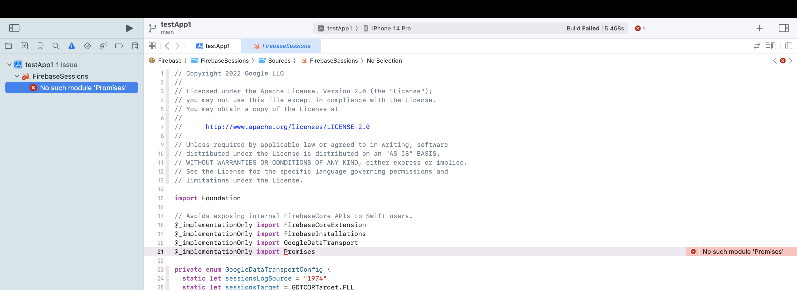

# Firebase iOS SDK 10.13.0

# Xcode 14.3.1

- Build for Running -> builds ok
- Build for Testing -> builds ok

# Xcode 15.0-beta5 (15A5209g)

- Build for Running -> builds ok
- Build for Testing -> **fails to build** with the following error:

`No such module 'Promises` in `FirebaseSessions` at line 21: `@_implementationOnly import Promises`

