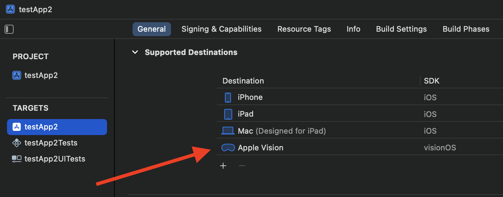
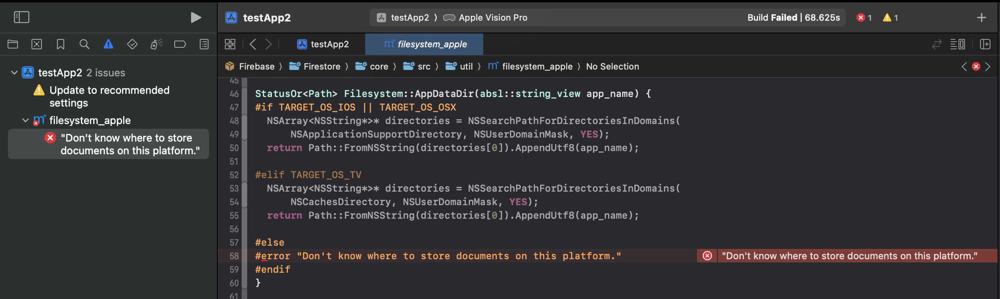

# testApp2

1. Create new Xcode project with Xcode v15.0.1
2. Add Firebase SDK v10.17.0 via SPM, as the only dependency in the Xcode project. `import Firebase` into the default `ContentView.swift`.
3. Confirm can successfully build the existing target and scheme with an iPhone as the run destination.
4. Close project file and Xcode v15.0.1
5. Open project file with Xcode v15.1.0-beta2 via: `open --env FIREBASE_SOURCE_FIRESTORE testApp2.xcodeproj -a /Applications/Xcode-15.1.0-Beta.2.app`
6. Add "Apple Vision" as a new supported destination (targeting the visionOS SDK), i.e.

   

7. Confirm can successfully build the existing target and scheme with an iPhone as the run destination.
8. Change the run destination to "Apple Vision Pro" and try to build, results in an error of `Don't know where to store documents on this platform.` from Firestore's `filesystem_apple.mm`, i.e.

   

9. This error persists after cleaning the build folder, deleting the derived data folder, and resetting the package cache.
